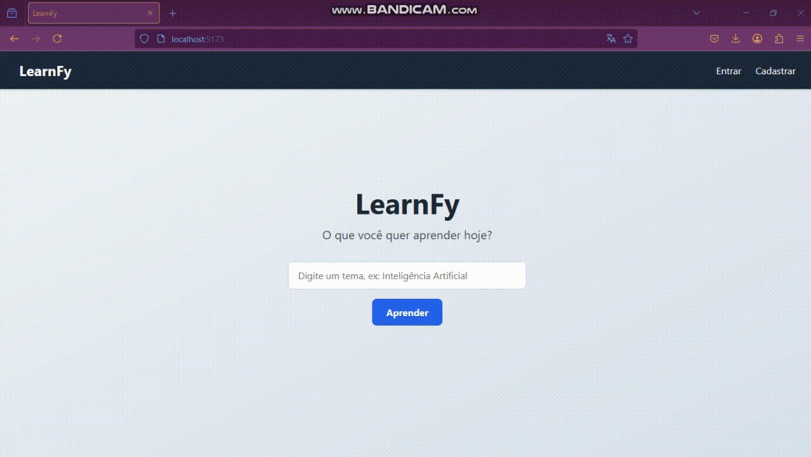

# LearnFy ✍️ 🤖

O **LearnFy**, um protótipo de aplicativo de aprendizagem que utiliza inteligência artificial rodando localmente com **Ollama** para gerar conteúdo educacional e quizzes de estudo.

---

<p align="center">
  
</p>

## 🚀 Visão Geral

LearnFy é uma aplicação web focada em proporcionar um **ambiente de estudo interativo**, onde o usuário pode solicitar conteúdos sobre um tema e, com base nesses conteúdos, gerar **questionários inteligentes para estudo**. A aplicação frontend é construída com **React** e integrada com um backend que utiliza **Ollama** para rodar modelos de IA localmente.

Este projeto é um protótipo que explora capacidades de IA **offline** com geração de conteúdo para apoio educacional.

---

## 📦 Funcionalidades

* 💻 Interface responsiva em React
* 📚 Tela inicial para entrada de tema de estudo
* 🤖 Integração com IA (Ollama) via backend local
* ✍️ Exibição de conteúdo gerado dinamicamente
* 📊 Geração de quizzes com base no conteúdo gerado
* 🚀 Fluxo completo de interação sem depender de APIs hospedadas na nuvem

---

## 🧠 Tecnologia Utilizada

| Categoria   | Tecnologia               |
| ----------- | ------------------------ |
| Frontend    | React                    |
| Build       | Vite                     |
| Estilização | CSS, Tailwind (opcional) |
| IA Local    | Ollama (via backend)     |
| Integração  | API REST fetch           |

---

## 📁 Estrutura do Projeto

A pasta principal do frontend `LEARNFY-FRONTED/` possui a seguinte organização típica:

```
LEARNFY-FRONTED/
├── public/                # Arquivos públicos estáticos
├── src/                   # Código-fonte principal
│   ├── components/        # Componentes React reutilizáveis
│   ├── pages/             # Páginas e visões principais
│   ├── services/          # Chamadas à API
│   ├── styles/            # Estilos e tema
│   ├── App.jsx            # Componente principal
│   └── index.jsx          # Entry point
├── .gitignore
├── package.json
├── vite.config.js
└── README.md
```

Essa estrutura ajuda a separar lógica, apresentação e integração com facilidade.

---

## 🛠️ Pré-requisitos

Antes de iniciar, certifique-se de ter as seguintes ferramentas instaladas:

* Node.js (versão 18+)
* Yarn
* Ollama instalado e configurado localmente

---

## 💻 Como Rodar o Projeto

1. Clone este repositório:

```bash
git clone https://github.com/Paulocarneiroo/WEB-APP-LEARNFY.git
```

2. Acesse a pasta do frontend:

```bash
cd WEB-APP-LEARNFY/FRONTEND/LEARNFY-FRONTED
```

3. Instale as dependências:

```bash
npm install
# ou
yarn install
```

4. Inicie o servidor de desenvolvimento:

```bash
npm run dev
# ou
yarn dev
```

5. Abra o navegador no endereço:

```
http://localhost:5173
```